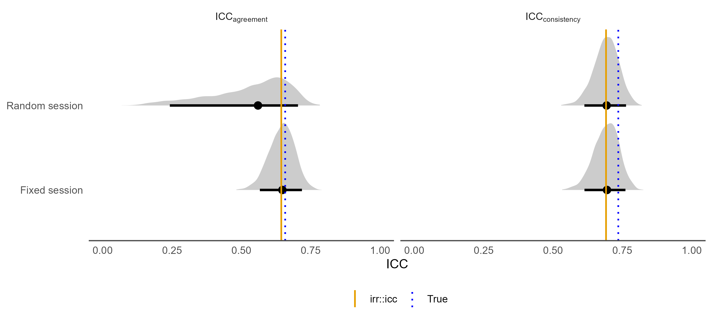
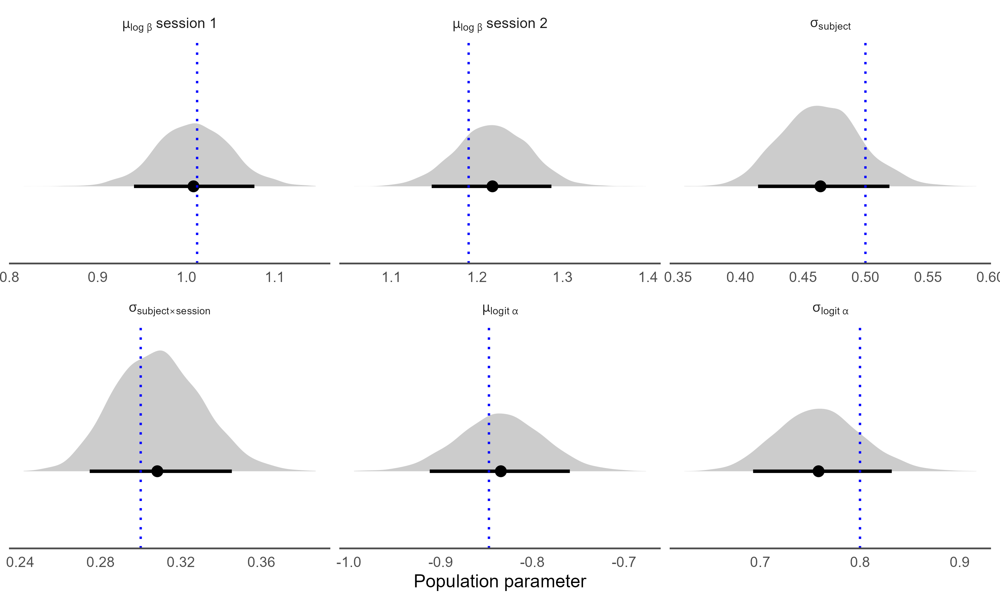
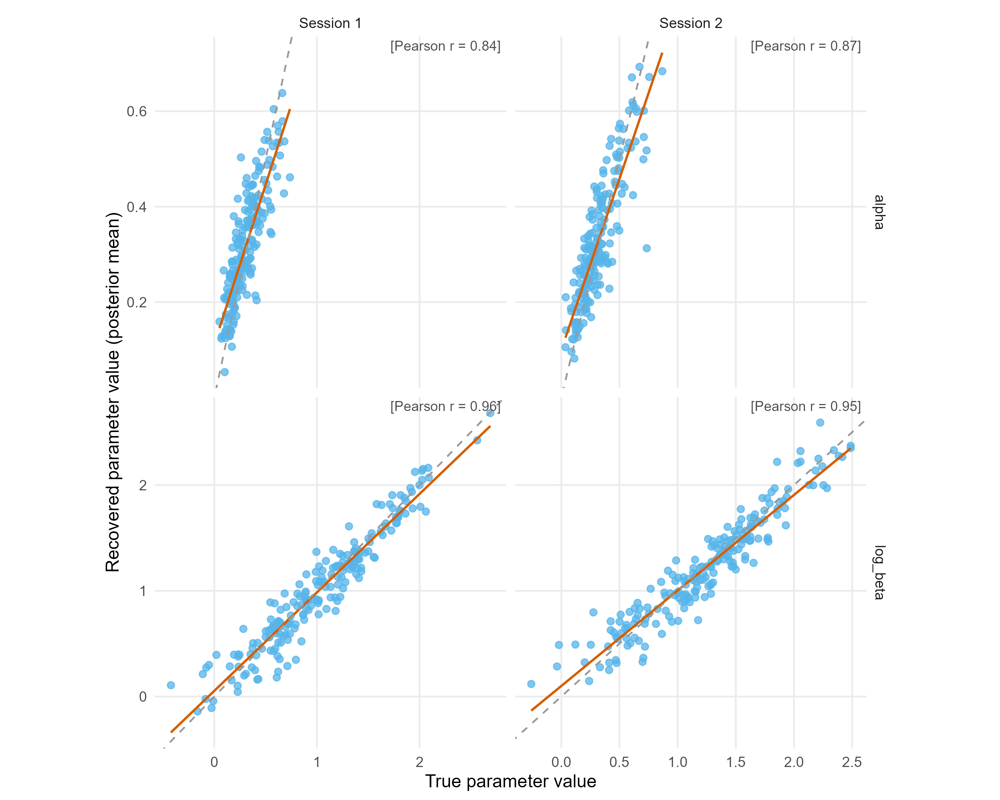

# param_recovery_stability_across_sessions

Simulation studies asking whether a Bayesian (Stan) model can recover the **test–retest reliability (ICC)** of a cognitive-model parameter measured in two sessions.

## ICC recovery for a reinforcement-learning model

### Question
In a two-session study, people's inverse temperature (β) changes somewhat from session to session. If we fit a hierarchical Q-learning model to their choices, can we recover the **true** ICC of β, even though β itself is never observed?

### Simulation
- **Task:** 2-armed bandit with reward probabilities 0.7 / 0.3. 200 subjects × 2 sessions × 200 trials.
- **Model:** Q-learning. Q-values start at 0.5 each session, and choices follow a softmax:
  $P(\text{arm }2) = \text{logit}^{-1}\big(\beta\,(Q_2 - Q_1)\big)$.
- **β** varies on the log scale:

  $$\log\beta_{ij} = \mu_{\text{session } j} + \underbrace{\gamma_i}_{\text{stable subject part}} + \underbrace{\gamma_{ij}}_{\text{session-to-session wobble}}$$

  with $\gamma_i \sim N(0, 0.5)$ and $\gamma_{ij} \sim N(0, 0.3)$. The session means were generated with a small session shift (σ_session = 0.2).
- **α** (learning rate) is drawn independently per subject × session on the logit scale.

There is no separate "noise" term on β: the wobble $\gamma_{ij}$ *is* the session-to-session noise. Choice randomness over 200 trials only makes β harder to estimate; it is not part of the true ICC.

### Fitted model: session as a fixed effect
We fit the same model with **one fixed mean per session** (`mu_log_beta[1]`, `mu_log_beta[2]`) rather than a random session effect. With only two sessions, a session SD (σ_session) is essentially not estimable. A random-session version gave a very wide agreement ICC and 28 divergent transitions, while the fixed-session version gave a narrow one and none.

Both ICCs are computed in every posterior draw from the estimated variance components:

$$\text{ICC}_{\text{consistency}} = \frac{\sigma^2_{\text{subject}}}{\sigma^2_{\text{subject}} + \sigma^2_{\text{subject}\times\text{session}}}
\qquad
\text{ICC}_{\text{agreement}} = \frac{\sigma^2_{\text{subject}}}{\sigma^2_{\text{subject}} + v_{\text{session}} + \sigma^2_{\text{subject}\times\text{session}}}$$

where $v_{\text{session}}$ is the variance of the two session means.

**Consistency vs agreement.** The only difference is $v_{\text{session}}$, the shift that moves *everyone* up or down between sessions. In this simulation β was on average ~20% higher in session 2. Consistency ignores that shift: it asks whether people keep the same *order*. Agreement counts it as disagreement: it asks whether people get the same *value*. Without a session shift the two ICCs would be identical.

### Results
Stan recovers both ICCs from the choices alone.

| | True (population) | `irr::icc` on true β | **Stan, fixed session** median [90% CI] |
|---|---|---|---|
| ICC agreement | 0.658 | 0.644 | **0.648** [0.57, 0.72] |
| ICC consistency | 0.735 | 0.691 | **0.695** [0.61, 0.76] |

- "True" comes from the population SDs. `irr::icc` is the ICC of the 200 subjects actually drawn, so it differs from "True" by sampling chance. Stan only sees this sample, so it tracks the `irr::icc` value.
- All population parameters fall inside their 90% intervals. Max R̂ = 1.009, with 0 divergent transitions.
- Individual log β is recovered well (r = 0.96 / 0.95 per session). α is recovered reasonably (r = 0.84 / 0.87).



*Posterior ICC (grey; dot = median, bar = 90% interval) against the true ICC (blue dotted) and `irr::icc` on the true β (orange). Fixed session gives a much tighter agreement ICC; consistency is the same in both models.*



*Population-level posteriors against true values (blue dotted).*



*True vs recovered (posterior mean) log β and α for each subject, by session.*

**Note:** don't compute the ICC by correlating per-subject posterior means across sessions. Shrinkage pulls a subject's two sessions together, so in this run that gave r = 0.75, compared with 0.69 for the true values. Use the ICC computed from the variance components instead.

### Running it
```r
source("simulation/param-rec-rl-bandit-fixed-session-stan/main.R")
```
All settings (number of subjects and trials, reward probabilities, true SDs) are at the top of `main.R`. The full fit takes ~30 min with 4 chains. Artifacts are regenerated by the run and are not committed.

## Repository layout

| Path | Contents |
|---|---|
| `models/rl-bandit-two-sessions/` | Generating code (`.R`) and random-session Stan model |
| `models/rl-bandit-two-sessions-fixed-session/` | Fixed-session Stan model (used for the results above) |
| `simulation/param-rec-rl-bandit-fixed-session-stan/` | Main RL ICC-recovery pipeline (fixed session) |
| `simulation/param-rec-rl-bandit-two-sessions-stan/` | Same pipeline with a random session effect, for comparison |
| `models/linear-reg-two-sessions/`, `simulation/param-rec-linear-reg-two-sessions-{stan,brms}/` | Earlier ICC recovery for a two-session linear model |
